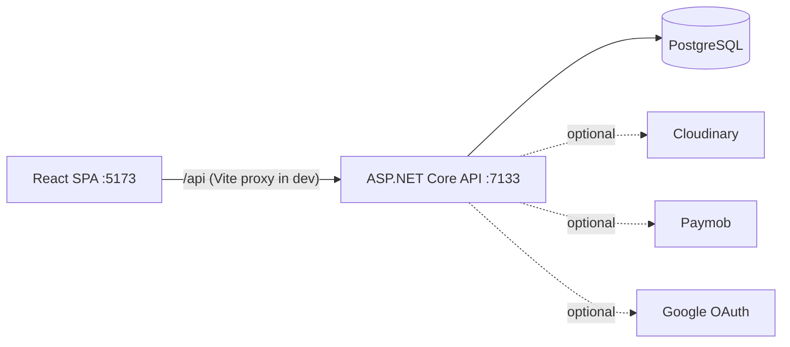

# Travel Explorer

A full-stack travel platform: browse destinations and flights, book stays and flights,
pay online, write reviews and blogs, and manage everything from an admin dashboard.

- Backend: ASP.NET Core 8 Web API (Clean Architecture + CQRS) with PostgreSQL.
- Frontend: React + Vite + TypeScript + Tailwind single-page app.

## Contents

- Backend docs: [Travel Explorer/README.md](Travel%20Explorer/README.md)
- Frontend docs: [travel-explorer-client/README.md](travel-explorer-client/README.md)
- Full API reference: [API.md](API.md)

## Features

- Public browsing: destinations (search/filter), destination details with activities and
  reviews, flights (search), blog articles, contact form.
- Traveler: stay and flight bookings, My Trips (cancel, edit notes, pay), reviews, profile,
  request the Author role.
- Author: create/edit/publish blog posts.
- Admin: dashboard stats, user management (block/unblock/role/soft-delete), approve/reject
  author requests, CRUD for destinations/activities/categories/flights, booking and flight
  booking status management, blog moderation, and a contact-message inbox.
- Auth: JWT access + refresh tokens, role-based access (`Admin`, `Traveler`, `Author`),
  optional Google sign-in.

## Tech stack

| Layer | Tech |
| --- | --- |
| Frontend | React 18, Vite, TypeScript, Tailwind, React Router, TanStack Query, axios, react-hook-form + zod |
| Backend | .NET 8, ASP.NET Core, EF Core 8, MediatR (CQRS), AutoMapper, FluentValidation, Identity + JWT |
| Database | PostgreSQL (Npgsql, `pg_trgm`) |
| Services | Cloudinary (uploads), Paymob (payments), Google OAuth |

## Folder structure

```
Travel Explorer.sln
Travel Explorer/                 # API layer (controllers, middleware, Program.cs, config) + backend README
Travel Explorer.Application/     # CQRS features, DTOs, validators, mapping
Travel Explorer.Domain/          # entities, enums, interfaces
Travel Explorer.Infrastructure/  # EF Core, migrations, repositories, external services
travel-explorer-client/          # React SPA (frontend)
API.md                           # API reference
README.md                        # this file
```

## How the frontend and backend communicate

- The SPA calls the API under `/api`. In development, Vite proxies `/api` to the backend
  (`https://localhost:7133` by default), so there is no CORS or dev-certificate friction.
- Auth: login returns `{ token: { accessToken, refreshToken } }`. The client stores both,
  sends `Authorization: Bearer <accessToken>`, and transparently refreshes via
  `POST /api/Auth/refresh-token` on a 401 (single-flight). The user's role is read by
  decoding the JWT.
- In production, set the client's `VITE_API_BASE_URL` to the API origin (CORS is open and
  the `X-Pagination` header is exposed for the admin user list).



## Local setup

Prerequisites: .NET 8 SDK, Node.js 18+, PostgreSQL.

1. Database: create/run a PostgreSQL instance. Update the connection string in
   `Travel Explorer/appsettings.Development.json` (or via env/User Secrets) if it differs
   from the default `Host=localhost;Port=5432;Database=TravelExplorer;Username=postgres;Password=postgres`.
2. Backend (on startup it applies migrations and seeds roles, the admin, and—on an empty
   database—realistic demo content: destinations, activities, flights, blogs, reviews, and demo users):
   ```bash
   dotnet dev-certs https --trust
   dotnet run --project "Travel Explorer" --launch-profile https
   ```
   API at `https://localhost:7133`, Swagger at `/swagger`.
3. Frontend:
   ```bash
   cd travel-explorer-client
   npm install
   npm run dev
   ```
   App at `http://localhost:5173`.
4. Sign in with the seeded admin: `admin` / `Admin@123`. Demo accounts are also seeded—an author
   (`maya.lawson`) and travelers like `liam.carter`—all with the password `Password@123`.

## Environment variables

There is no root `.env` - each side has its own (the API also accepts User Secrets and
appsettings). See:

- Backend: [Travel Explorer/.env.example](Travel%20Explorer/.env.example) - DB connection,
  JWT, Google, Cloudinary, Paymob, seeded admin.
- Frontend: [travel-explorer-client/.env.example](travel-explorer-client/.env.example) -
  `VITE_API_BASE_URL` (prod API origin; empty in dev to use the proxy) and
  `VITE_DEV_API_TARGET` (dev proxy target, default `https://localhost:7133`).

## API overview

Full reference in [API.md](API.md). Frontend -> backend contract map:

| Feature | Frontend (function) | Request | Backend handler | Response |
| --- | --- | --- | --- | --- |
| Login | `authApi.login` | `POST /api/Auth/login` | `AuthController.Login` | `{ token: { accessToken, refreshToken } }` |
| Register | `authApi.register` | `POST /api/Auth/register` | `AuthController.Register` | `{ id, userName, email, fullName, role }` |
| Refresh | apiClient interceptor | `POST /api/Auth/refresh-token` | `AuthController.RefreshToken` | `{ accessToken, refreshToken }` |
| Browse destinations | `destinationsApi.list` | `GET /api/Destinations?...` | `DestinationsController.GetAll` | `PaginatedResult<DestinationDto>` |
| Destination detail | `destinationsApi.get/activities/reviews` | `GET /api/Destinations/{id}[/activities|/reviews]` | `DestinationsController` | `DestinationDto` / `ActivityDto[]` / `ReviewDto[]` |
| Create stay booking | `destinationBookingsApi.create` | `POST /api/DestinationBookings` | `DestinationBookingsController.Create` | `DestinationBookingDto` |
| My trips | `destinationBookingsApi.mine` | `GET /api/DestinationBookings/my` | `...GetMyBookings` | `DestinationBookingDto[]` |
| Pay | `paymentsApi.checkout` | `POST /api/payments/checkout/{id}` | `PaymentsController.Checkout` | `{ checkoutUrl }` |
| Flights | `flightsApi.list` | `GET /api/Flights?...` | `FlightsController.GetAll` | `PaginatedResult<FlightScheduleDto>` |
| Book flight | `flightBookingsApi.create` | `POST /api/FlightBookings` | `FlightBookingsController.Create` | `FlightBookingDto` |
| Reviews | `reviewsApi.create/update` | `POST/PUT /api/Reviews` | `ReviewsController` | `ReviewDto` |
| Blogs | `blogsApi.*` | `/api/Blogs` | `BlogsController` | `BlogDto` / `PaginatedResult<BlogDto>` |
| Profile | `profileApi.get/update` | `GET/PUT /api/UserProfile` | `UserProfileController` | `UserProfileDto` |
| Image upload | `uploadApi.image` | `POST /api/Upload/image` | `UploadController` | `{ url, publicId }` |
| Admin users | `adminApi.users` | `GET /api/Admin` (+`X-Pagination`) | `AdminController.GetAll` | `UserDto[]` + header |
| Admin stats | `adminApi.statistics` | `GET /api/Admin/statistics` | `...GetStatistics` | `AdminStatisticsDto` |

## Common issues

- Backend won't start / "Failed to connect to ...:5432": PostgreSQL not running or wrong
  connection string.
- Client can't reach API: ensure the backend runs on `https://localhost:7133` (https
  profile) and the dev cert is trusted, or set `VITE_DEV_API_TARGET` to your API URL.
- Google / Cloudinary / Paymob do nothing: their credentials are not configured (optional).

## Verification checklist

- [ ] `dotnet build "Travel Explorer.sln"` succeeds (0 errors).
- [ ] `npm run build` in `travel-explorer-client` succeeds (0 errors).
- [ ] Backend starts, applies migrations, seeds admin; Swagger loads at `/swagger`.
- [ ] Frontend starts at `:5173` and reaches the API through the proxy.
- [ ] Register -> auto login works; role-gated routes redirect correctly.
- [ ] Browse destinations/flights/blogs (search + pagination) works.
- [ ] Traveler: create booking, see it in My Trips, cancel/edit notes; "Pay now" redirects.
- [ ] Author: create/edit/publish a blog.
- [ ] Admin (`admin`/`Admin@123`): dashboard stats, users, content CRUD, bookings, messages.
- [ ] API error responses surface as toasts in the UI.

## Known limitations

- Online payments need real Paymob keys (checkout UI is wired); flight-booking payment is
  not offered because the checkout endpoint handles stay bookings only.
- Image upload needs Cloudinary credentials (forms also accept a pasted image URL).
- Google sign-in is only wired up when Google OAuth credentials are configured; until then the
  backend skips registering the Google scheme (so the rest of the API works) and the SPA's
  "Continue with Google" button shows a "coming soon" notice.
- Blog lists (author + admin) show published posts only, because the list endpoint filters
  out drafts.
