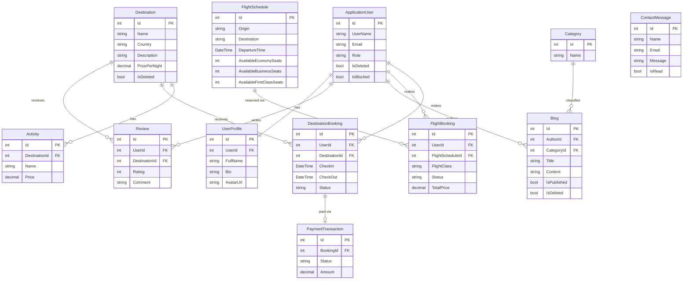

<h1 align="center">✈️ Travel Explorer</h1>

<p align="center">
  <strong>A production-ready Travel & Tourism Booking API</strong><br/>
  Explore destinations, book flights & activities, manage travel blogs — all through a scalable, clean-architecture backend built with .NET 8.
</p>

<p align="center">
  
  
  
  
  
</p>

---

## 📋 Table of Contents

- [Overview](#-overview)
- [Tech Stack](#️-tech-stack)
- [System Architecture](#️-system-architecture--clean-architecture)
- [CQRS with MediatR](#-cqrs-pattern-with-mediatr)
- [ERD](#-entity-relationship-diagram-erd)
- [Key Features & Business Logic](#-key-features--business-logic)
- [Getting Started](#-getting-started)
- [API Documentation](#-api-documentation)
- [Project Structure](#-project-structure)

---

## 🌍 Overview

**Travel Explorer** is a fully-featured **RESTful API** that serves as the backbone of a modern travel platform. It enables users to:

- 🗺️ **Browse and search** destinations, activities, and flights with advanced filtering and pagination.
- 🛫 **Book flights** with real-time seat inventory management across Economy, Business, and First Class.
- 🏨 **Reserve stays** at curated destinations and manage bookings through a full lifecycle.
- ✍️ **Write and publish travel blogs**, with a draft/publish workflow and role-based moderation.
- 📊 **Manage the platform** via a feature-rich admin dashboard with live statistics.

---

## 🛠️ Tech Stack

| Category | Technology |
|---|---|
| **Framework** | ASP.NET Core 8 Web API |
| **Architecture** | Clean Architecture (4-layer) |
| **Pattern** | CQRS via **MediatR** |
| **ORM** | Entity Framework Core 8 |
| **Database** | PostgreSQL (Npgsql) |
| **Authentication** | ASP.NET Core Identity + JWT (Access & Refresh Tokens) |
| **Validation** | FluentValidation (Pipeline Behavior) |
| **Mapping** | AutoMapper |
| **Media Storage** | Cloudinary |
| **Payments** | Paymob |
| **API Docs** | Swagger / OpenAPI |
| **Concurrency** | EF Core Optimistic Concurrency (`xmin` + `IsConcurrencyToken()`) |

---

## 🏛️ System Architecture — Clean Architecture

The solution is **strictly organized into 4 decoupled layers**, each with a single, well-defined responsibility. Dependencies only flow **inward** — outer layers depend on inner layers, never the reverse.

```
┌──────────────────────────────────────────────────────────────┐
│                         WebAPI Layer                         │
│   Controllers │ Middleware │ Filters │ Program.cs            │
│   → Receives HTTP requests, delegates to MediatR             │
└─────────────────────┬────────────────────────────────────────┘
                      │ depends on
┌─────────────────────▼────────────────────────────────────────┐
│                     Application Layer                        │
│   CQRS Commands & Queries │ Handlers │ DTOs │ Validators     │
│   → Contains all business use-case logic                     │
└─────────────────────┬────────────────────────────────────────┘
                      │ depends on
┌─────────────────────▼────────────────────────────────────────┐
│                      Domain Layer                            │
│   Entities │ Enums │ Interfaces │ Domain Rules               │
│   → The core of the system — zero external dependencies      │
└──────────────────────────────────────────────────────────────┘
                      ▲
                      │ implements
┌─────────────────────┴────────────────────────────────────────┐
│                  Infrastructure Layer                        │
│   EF Core DbContext │ Repositories │ Migrations              │
│   JWT Service │ Cloudinary │ Paymob │ Email                  │
│   → Handles all I/O and external integrations                │
└──────────────────────────────────────────────────────────────┘
```

### Layer Responsibilities

| Layer | Responsibility |
|---|---|
| **Domain** | Pure C# entities, enums, and repository/service interfaces. Zero dependencies on any framework. |
| **Application** | All CQRS commands, queries, handlers, DTOs, AutoMapper profiles, and FluentValidation validators. |
| **Infrastructure** | EF Core configurations, migrations, concrete repository implementations, JWT, Cloudinary, Paymob. |
| **WebAPI** | Controllers, middleware (global exception handling, auth), and DI wiring in `Program.cs`. |

---

## ⚡ CQRS Pattern with MediatR

The API applies **Command Query Responsibility Segregation (CQRS)** end-to-end, separating read and write operations for maximum scalability and maintainability.

```
HTTP Request
     │
     ▼
Controller (thin — no logic)
     │
     │  mediator.Send(command/query)
     ▼
MediatR Pipeline
     │
     ├── ValidationBehavior (FluentValidation)
     │        └── Throws ValidationException on failure
     │
     └── Handler (IRequestHandler<TRequest, TResponse>)
              ├── Commands → Write operations (Create, Update, Delete)
              │     └── Returns Result<T> or void
              └── Queries  → Read operations (Get, List, Search)
                    └── Returns DTO / PaginatedResult<T>
```

**Example feature slice** (`FlightBookings`):
```
Features/FlightBookings/
├── Commands/
│   ├── CreateFlightBooking/
│   │   ├── CreateFlightBookingCommand.cs
│   │   ├── CreateFlightBookingCommandHandler.cs
│   │   └── CreateFlightBookingValidator.cs
│   └── UpdateFlightBookingStatus/
│       ├── UpdateFlightBookingStatusCommand.cs
│       └── UpdateFlightBookingStatusCommandHandler.cs
└── Queries/
    ├── GetAllFlightBookings/
    └── GetMyFlightBookings/
```

---

## 🗄️ Entity Relationship Diagram (ERD)



---

## 🚀 Key Features & Business Logic

### ✈️ Dynamic Flight Booking with Seat Inventory Management

When a user books a flight, the system **automatically deducts seats** from the correct inventory bucket based on the selected `FlightClass`:

- `Economy` → decrements `AvailableEconomySeats`
- `Business` → decrements `AvailableBusinessSeats`
- `FirstClass` → decrements `AvailableFirstClassSeats`

On **cancellation or refund**, the handler detects the status transition and **restores the exact seat count** back to the `FlightSchedule`, maintaining perfect inventory accuracy.

---

### 🔒 Concurrency & Race Condition Prevention

To prevent **double-booking** under heavy concurrent load, the system uses **Optimistic Concurrency Control** at two levels:

1. **PostgreSQL `xmin` system column** — configured via `builder.UseXminAsConcurrencyToken()` in EF Core, which automatically tracks row versions at the database level.

2. **Explicit concurrency tokens** — each seat-count property on `FlightSchedule` is decorated with `.IsConcurrencyToken()` in the EF Core configuration, ensuring that any concurrent write conflict raises a `DbUpdateConcurrencyException`.

3. **Retry logic in handlers** — the `CreateFlightBookingCommandHandler` catches `DbUpdateConcurrencyException` and retries the operation with a fresh read, guaranteeing **exactly-once seat deduction**.

```csharp
// FlightScheduleConfiguration.cs
builder.Property(p => p.AvailableEconomySeats).IsConcurrencyToken();
builder.Property(p => p.AvailableBusinessSeats).IsConcurrencyToken();
builder.Property(p => p.AvailableFirstClassSeats).IsConcurrencyToken();
```

---

### 🛡️ Security — Role-Based Access Control (RBAC)

The API enforces **three distinct roles**, each with strictly scoped permissions:

| Role | Permissions |
|---|---|
| **Admin** | Full CRUD on all resources, user management (block/unblock/role assignment/soft-delete), booking status overrides, blog moderation, contact message inbox, statistics dashboard. |
| **Author** | Create, edit, and publish own blog posts; request Author role promotion. |
| **Traveler** | Browse destinations & flights, create and manage own bookings, write reviews, manage own profile. |

All endpoints are protected via **JWT Bearer tokens**, with `[Authorize(Roles = "...")]` applied at the controller or action level.

---

### 🧹 Clean Code Practices

| Practice | Implementation |
|---|---|
| **Soft Delete** | All major entities (User, Destination, Blog) have an `IsDeleted` flag; queries are globally filtered via EF Core Query Filters. |
| **Global Exception Handling** | A custom `ExceptionMiddleware` intercepts all unhandled exceptions and returns consistent `ProblemDetails` JSON responses. |
| **Validation Pipeline** | `ValidationBehavior<TRequest, TResponse>` (MediatR pipeline behavior) runs FluentValidation **before** any handler executes, returning structured 400 responses. |
| **Repository + Unit of Work** | Abstracts all data access behind `IRepository<T>` and `IUnitOfWork`, keeping handlers free of EF Core concerns. |
| **Paginated Responses** | All list endpoints return `PaginatedResult<T>` with `TotalCount`, `PageNumber`, and `PageSize`. |

---

## 🏁 Getting Started

### Prerequisites

- [.NET 8 SDK](https://dotnet.microsoft.com/download/dotnet/8.0)
- [PostgreSQL](https://www.postgresql.org/download/) (local or Docker)
- [Git](https://git-scm.com/)

### 1. Clone the repository

```bash
git clone https://github.com/Mw8969040/Travel-Explorer.git
cd "Travel Explorer"
```

### 2. Configure the connection string

Open `Travel Explorer/appsettings.Development.json` and set your PostgreSQL connection string:

```json
{
  "ConnectionStrings": {
    "DefaultConnection": "Host=localhost;Port=5432;Database=TravelExplorer;Username=postgres;Password=your_password"
  }
}
```

### 3. Configure optional services (in `appsettings.json` or User Secrets)

```json
{
  "JWT": { "Key": "...", "Issuer": "...", "Audience": "..." },
  "Cloudinary": { "CloudName": "...", "ApiKey": "...", "ApiSecret": "..." },
  "Paymob": { "ApiKey": "...", "IntegrationId": "..." }
}
```

### 4. Apply migrations & seed data

The application **automatically applies migrations and seeds** data on startup (roles, admin user, and demo content). No manual `dotnet ef` commands needed.

Alternatively, apply manually:

```bash
dotnet ef database update --project "Travel Explorer.Infrastructure" --startup-project "Travel Explorer"
```

### 5. Run the application

```bash
dotnet dev-certs https --trust
dotnet run --project "Travel Explorer" --launch-profile https
```

The API will be available at:
- 🌐 **API Base URL**: `https://localhost:7133`
- 📄 **Swagger UI**: `https://localhost:7133/swagger`

### 6. Default credentials (seeded)

| Account | Username | Password |
|---|---|---|
| Admin | `admin` | `Admin@123` |
| Author | `maya.lawson` | `Password@123` |
| Traveler | `liam.carter` | `Password@123` |

---

## 📄 API Documentation

All endpoints are **fully documented and testable via Swagger UI**. The interactive docs include:

- ✅ Complete request/response schemas for every endpoint
- 🔐 JWT Bearer authorization (click **Authorize** in Swagger and paste your token)
- 📦 Paginated responses with proper metadata headers
- 🔍 Detailed error response models (`ValidationProblemDetails`, `ProblemDetails`)

| Module | Base Route |
|---|---|
| Auth (Login / Register / Refresh) | `/api/Auth` |
| Destinations | `/api/Destinations` |
| Activities | `/api/Activities` |
| Destination Bookings | `/api/DestinationBookings` |
| Flights | `/api/Flights` |
| Flight Bookings | `/api/FlightBookings` |
| Reviews | `/api/Reviews` |
| Blogs | `/api/Blogs` |
| Payments | `/api/Payments` |
| User Profile | `/api/UserProfile` |
| Admin | `/api/Admin` |
| Image Upload | `/api/Upload` |

---

## 📁 Project Structure

```
Travel Explorer.sln
│
├── Travel Explorer/                  ← WebAPI layer
│   ├── Controllers/                  ← Thin controllers (no business logic)
│   ├── Middleware/                   ← Global exception handler, auth
│   └── Program.cs                   ← DI registration, pipeline config
│
├── Travel Explorer.Application/      ← Application layer (CQRS core)
│   ├── Features/                     ← Feature slices (Commands & Queries)
│   │   ├── Blogs/
│   │   ├── Destinations/
│   │   ├── FlightBookings/
│   │   └── ... (12 feature modules)
│   ├── Common/                       ← Behaviors, specs, pagination
│   ├── DTOs/                         ← Data Transfer Objects
│   └── Mapping/                      ← AutoMapper profiles
│
├── Travel Explorer.Domain/           ← Domain layer (pure C#)
│   ├── Entities/                     ← Core domain entities
│   ├── Enums/                        ← FlightClass, BookingStatus, etc.
│   └── Interfaces/                   ← IRepository<T>, IUnitOfWork, etc.
│
└── Travel Explorer.Infrastructure/   ← Infrastructure layer
    ├── Configurations/               ← EF Core entity configurations
    ├── Migrations/                   ← EF Core migrations
    ├── Repositories/                 ← GenericRepository, UnitOfWork
    └── Services/                     ← JWT, Cloudinary, Paymob, Seeder
```

---

## 📜 License

This project is licensed under the **MIT License** — see the [LICENSE](LICENSE) file for details.

---

<p align="center">
  Built with ❤️ using <strong>.NET 8</strong> · Clean Architecture · CQRS · PostgreSQL
</p>
