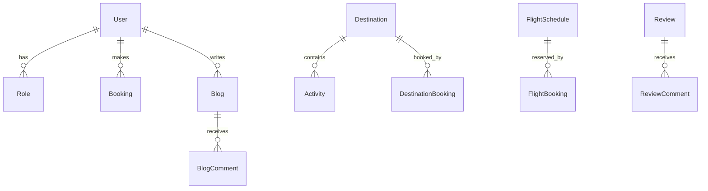

# Travel Explorer (Backend Only)

## 🌟 Overview
A **clean‑architecture** ASP.NET Core 8 web API that powers a full‑stack travel platform.  The backend handles:
- Destination & activity browsing
- Stay and flight bookings
- Payments integration (Paymob)
- User management (Admins, Travelers, Authors)
- Blog creation & moderation (including draft support)
- Rich statistics and admin dashboards

The original React front‑end (`travel‑explorer‑client`) has been removed, leaving a **robust, production‑ready API** ready for any client (mobile, SPA, server‑side rendering, etc.).

---

## 🏗️ Architecture & System Design
```mermaid
flowchart LR
    subgraph API[ASP.NET Core API]
        Controllers[Controllers]
        Services[Application Services]
        MediatR[MediatR (CQRS)]
        AutoMapper[AutoMapper]
        Validation[FluentValidation]
    end
    subgraph Infra[Infrastructure]
        EFCore[Entity Framework Core]
        Repos[Repositories]
        JWT[JWT Auth]
        Cloudinary[Cloudinary Service]
        Paymob[Paymob Service]
    end
    subgraph DB[PostgreSQL]
        DBTables[Tables]
    end

    Controllers --> MediatR
    MediatR --> Services
    Services --> EFCore
    EFCore --> DBTables
    Services --> Cloudinary
    Services --> Paymob
    Services --> JWT
    JWT --> DBTables
```

### Entity‑Relationship Diagram (ERD)


---

## 🛠️ Tech Stack
| Layer | Technology |
|---|---|
| **API** | ASP.NET Core 8, Clean Architecture, CQRS (MediatR) |
| **ORM** | Entity Framework Core 8 (PostgreSQL) |
| **Mapping** | AutoMapper |
| **Validation** | FluentValidation |
| **Authentication** | JWT + ASP.NET Identity |
| **Payments** | Paymob SDK |
| **Media** | Cloudinary |
| **Testing** | xUnit, Moq |

---

## 🚀 Getting Started (Backend only)
1. **Prerequisites**: .NET 8 SDK, PostgreSQL (Docker/Local), Git.
2. **Clone & cd**:
   ```bash
   git clone https://github.com/Mw8969040/Travel-Explorer.git
   cd "Travel Explorer"
   ```
3. **Configure DB** – set `ConnectionStrings:DefaultConnection` in `appsettings.Development.json` or via user‑secrets.
4. **Run migrations & seed data** (handled automatically on startup).
5. **Start the API**:
   ```bash
   dotnet dev-certs https --trust
   dotnet run --project "Travel Explorer" --launch-profile https
   ```
   Swagger UI available at `https://localhost:7133/swagger`.

---

## 📚 Documentation
- **API Reference**: `API.md`
- **Architecture notes**: this README + inline code comments.
- **Postman collection** (optional) – can be generated from Swagger.

---

## 🤝 Contributing
We welcome contributions! Please:
1. Fork the repo.
2. Create a feature branch (`git checkout -b feature/your‑feature`).
3. Ensure all tests pass (`dotnet test`).
4. Open a Pull Request with a clear description.

---

## 📄 License
MIT – see `LICENSE` file.
